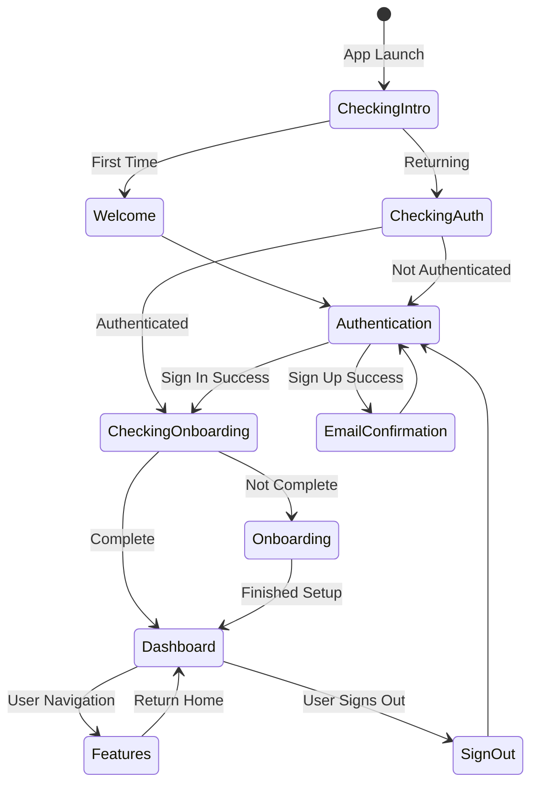

# MoneyBees (Effortless Spend Sense) - User Flow Diagram

## Complete User Journey Flow

```mermaid
flowchart TD
    Start([App Launch]) --> CheckIntro{First Time User?}

    %% First Time User Path
    CheckIntro -->|Yes| Welcome[Welcome Screen]
    Welcome --> Auth1[Auth Page]

    %% Returning User Path
    CheckIntro -->|No| CheckAuth{Authenticated?}
    CheckAuth -->|No| Auth1
    CheckAuth -->|Yes| CheckOnboarding{Onboarding Complete?}

    %% Authentication Flow
    Auth1 --> AuthChoice{User Action}
    AuthChoice -->|Sign In| SignIn[Sign In Form]
    AuthChoice -->|Sign Up| SignUp[Sign Up Form]
    AuthChoice -->|Forgot Password| ResetPwd[Password Reset]

    SignIn --> AuthSuccess{Auth Successful?}
    SignUp --> ConfirmEmail[Email Confirmation]
    ConfirmEmail --> SignIn
    ResetPwd --> CheckEmail[Check Email for Link]
    CheckEmail --> SignIn

    AuthSuccess -->|Yes| CheckOnboarding
    AuthSuccess -->|No| Auth1

    %% Onboarding Flow
    CheckOnboarding -->|No| Onboarding[Onboarding Steps]
    Onboarding --> SetPreferences[Set User Preferences]
    SetPreferences --> Dashboard

    CheckOnboarding -->|Yes| Dashboard[🏠 Home Dashboard]

    %% Main Dashboard Features
    Dashboard --> DashboardFeatures{User Action}
    DashboardFeatures --> ViewTransactions[View Transactions List]
    DashboardFeatures --> QuickStats[Financial Overview]
    DashboardFeatures --> RecentActivity[Recent Activity Feed]

    %% Bottom Navigation (Primary)
    Dashboard --> BottomNav{Bottom Navigation}

    BottomNav -->|Home Icon| Dashboard
    BottomNav -->|Budgets Icon| Budgets[📊 Budgets Page]
    BottomNav -->|Plus FAB| AddExpense[➕ Add Expense Modal]
    BottomNav -->|Analytics Icon| Analytics[📈 Analytics Page]
    BottomNav -->|Growth Icon| Growth[📈 Growth Page]

    %% Add Expense Flow
    AddExpense --> ExpenseForm[Expense Entry Form]
    ExpenseForm --> EnterDetails[Enter Amount, Category, etc.]
    EnterDetails --> SaveExpense{Save}
    SaveExpense -->|Confirm| Dashboard
    SaveExpense -->|Cancel| Dashboard

    %% Budget Management
    Budgets --> BudgetActions{Budget Actions}
    BudgetActions --> CreateBudget[Create New Budget]
    BudgetActions --> ViewBudget[View Budget Details]
    BudgetActions --> EditBudget[Edit Budget]
    BudgetActions --> DeleteBudget[Delete Budget]
    CreateBudget --> Budgets
    EditBudget --> Budgets
    DeleteBudget --> Budgets
    ViewBudget --> BudgetProgress[View Budget Progress]
    BudgetProgress --> Budgets

    %% Analytics Features
    Analytics --> AnalyticsViews{Analytics Views}
    AnalyticsViews --> SpendingTrends[Spending Trends]
    AnalyticsViews --> CategoryBreakdown[Category Breakdown]
    AnalyticsViews --> MonthlyComparison[Monthly Comparison]
    AnalyticsViews --> CustomReports[Custom Reports]

    %% Growth Tracking
    Growth --> GrowthFeatures{Growth Features}
    GrowthFeatures --> NetWorth[Net Worth Tracking]
    GrowthFeatures --> SavingsRate[Savings Rate]
    GrowthFeatures --> FinancialGoals[Financial Goals Progress]

    %% Secondary Navigation (Menu/Drawer)
    Dashboard --> Menu{Menu Options}

    Menu --> Transactions[💳 Transactions Page]
    Menu --> Goals[🎯 Goals Page]
    Menu --> Scanner[📷 Receipt Scanner]
    Menu --> Calendar[📅 Monthly Report]
    Menu --> Accounts[🏦 Accounts Page]
    Menu --> Investments[💼 Investments Page]
    Menu --> Recurring[🔄 Recurring Transactions]
    Menu --> Reports[📊 Reports Page]
    Menu --> BillSplitter[👥 Bill Splitter]
    Menu --> Notifications[🔔 Notifications]
    Menu --> Settings[⚙️ Settings]
    Menu --> Security[🔒 Security]
    Menu --> Help[❓ Help & Support]

    %% Transactions Flow
    Transactions --> TransactionList[Transaction List]
    TransactionList --> FilterTransactions[Filter & Search]
    TransactionList --> TransactionDetail[Transaction Detail View]
    TransactionDetail --> EditTransaction[Edit Transaction]
    TransactionDetail --> DeleteTransaction[Delete Transaction]
    EditTransaction --> Transactions
    DeleteTransaction --> Transactions

    %% Goals Management
    Goals --> GoalActions{Goal Actions}
    GoalActions --> CreateGoal[Create New Goal]
    GoalActions --> ViewGoal[View Goal Details]
    GoalActions --> UpdateProgress[Update Goal Progress]
    GoalActions --> EditGoal[Edit Goal]
    CreateGoal --> Goals
    UpdateProgress --> Goals
    EditGoal --> Goals

    %% Scanner Flow
    Scanner --> ScannerChoice{Scanner Action}
    ScannerChoice --> CameraCapture[Capture Receipt Photo]
    ScannerChoice --> UploadImage[Upload from Gallery]
    CameraCapture --> ProcessReceipt[AI Processing]
    UploadImage --> ProcessReceipt
    ProcessReceipt --> ExtractData[Extract Transaction Data]
    ExtractData --> ReviewData[Review & Confirm]
    ReviewData --> SaveTransaction[Save Transaction]
    SaveTransaction --> Dashboard

    %% Monthly Report
    Calendar --> CalendarFeatures{Calendar Features}
    CalendarFeatures --> ViewByMonth[Monthly View]
    CalendarFeatures --> ViewByWeek[Weekly View]
    CalendarFeatures --> ViewByDay[Daily View]
    CalendarFeatures --> UpcomingBills[Upcoming Bills]

    %% Accounts Management
    Accounts --> AccountActions{Account Actions}
    AccountActions --> AddAccount[Add New Account]
    AccountActions --> ViewAccountDetail[View Account Details]
    AccountActions --> EditAccount[Edit Account]
    AccountActions --> ManageCards[Manage Credit Cards]
    AddAccount --> Accounts
    EditAccount --> Accounts
    ManageCards --> CardManagement[Credit Card Manager]
    CardManagement --> Accounts

    %% Investments Tracking
    Investments --> InvestmentFeatures{Investment Features}
    InvestmentFeatures --> PortfolioView[Portfolio Overview]
    InvestmentFeatures --> AssetAllocation[Asset Allocation]
    InvestmentFeatures --> PerformanceMetrics[Performance Metrics]

    %% Recurring Transactions
    Recurring --> RecurringActions{Recurring Actions}
    RecurringActions --> AddRecurring[Add Recurring Transaction]
    RecurringActions --> ViewRecurring[View Recurring List]
    RecurringActions --> EditRecurring[Edit Recurring]
    AddRecurring --> Recurring
    EditRecurring --> Recurring

    %% Reports Generation
    Reports --> ReportTypes{Report Types}
    ReportTypes --> IncomeReport[Income Report]
    ReportTypes --> ExpenseReport[Expense Report]
    ReportTypes --> TaxReport[Tax Report]
    ReportTypes --> CustomReport[Custom Report]
    ReportTypes --> ExportData[Export Data]

    %% Bill Splitter
    BillSplitter --> BillSplitFlow{Split Actions}
    BillSplitFlow --> CreateSplit[Create New Split]
    BillSplitFlow --> ViewSplits[View Split History]
    CreateSplit --> AddParticipants[Add Participants]
    AddParticipants --> CalculateSplit[Calculate Amounts]
    CalculateSplit --> ShareSplit[Share Split Details]
    ShareSplit --> Dashboard

    %% Notifications
    Notifications --> NotificationTypes{Notification Types}
    NotificationTypes --> BudgetAlerts[Budget Alerts]
    NotificationTypes --> BillReminders[Bill Reminders]
    NotificationTypes --> GoalUpdates[Goal Updates]
    NotificationTypes --> SystemNotifications[System Notifications]

    %% Settings
    Settings --> SettingsOptions{Settings Options}
    SettingsOptions --> ProfileSettings[Profile Settings]
    SettingsOptions --> AppPreferences[App Preferences]
    SettingsOptions --> NotificationSettings[Notification Settings]
    SettingsOptions --> ThemeSettings[Theme Settings]
    SettingsOptions --> DataSync[Data Sync]
    SettingsOptions --> SignOut[Sign Out]
    SignOut --> Auth1

    %% Security Settings
    Security --> SecurityFeatures{Security Features}
    SecurityFeatures --> AppLock[App Lock/PIN]
    SecurityFeatures --> Biometric[Biometric Auth]
    SecurityFeatures --> PrivacySettings[Privacy Settings]
    SecurityFeatures --> DataSecurity[Data Security]

    %% Help & Support
    Help --> HelpOptions{Help Options}
    HelpOptions --> FAQs[FAQs]
    HelpOptions --> Tutorials[Tutorials]
    HelpOptions --> ContactSupport[Contact Support]
    HelpOptions --> Documentation[Documentation]

    %% Global Actions (Available from anywhere)
    Dashboard -.->|Floating Action Button| GlobalAddExpense[Quick Add Expense]
    Transactions -.->|Floating Action Button| GlobalAddExpense
    Budgets -.->|Floating Action Button| GlobalAddExpense
    Analytics -.->|Floating Action Button| GlobalAddExpense
    GlobalAddExpense --> ExpenseForm

    %% Style Definitions
    classDef primaryPage fill:#3b82f6,stroke:#1e40af,stroke-width:3px,color:#fff
    classDef secondaryPage fill:#10b981,stroke:#059669,stroke-width:2px,color:#fff
    classDef actionNode fill:#f59e0b,stroke:#d97706,stroke-width:2px,color:#fff
    classDef decisionNode fill:#8b5cf6,stroke:#6d28d9,stroke-width:2px,color:#fff
    classDef entryPoint fill:#ef4444,stroke:#dc2626,stroke-width:3px,color:#fff

    class Dashboard,Budgets,Analytics,Growth primaryPage
    class Transactions,Goals,Scanner,Calendar,Accounts secondaryPage
    class AddExpense,ExpenseForm,CreateBudget,CreateGoal actionNode
    class CheckAuth,CheckOnboarding,AuthChoice,BudgetActions decisionNode
    class Start,Auth1 entryPoint
```



## Key User Journeys

### 1. **New User Onboarding**
```
App Launch → Welcome Screen → Auth (Sign Up) → Email Confirmation →
Sign In → Onboarding Steps → Set Preferences → Dashboard
```

### 2. **Daily Usage (Add Expense)**
```
Dashboard → Floating Action Button (FAB) → Add Expense Modal →
Enter Details (Amount, Category, Account) → Save → Dashboard
```

### 3. **Budget Management**
```
Dashboard → Bottom Nav (Budgets) → Budgets Page → Create Budget →
Set Amount & Category → Save → View Budget Progress → Dashboard
```

### 4. **Receipt Scanning**
```
Dashboard → Menu (Scanner) → Scanner Page → Capture Photo →
AI Processing → Extract Data → Review & Confirm → Save Transaction → Dashboard
```

### 5. **Analytics Review**
```
Dashboard → Bottom Nav (Analytics) → Analytics Page →
View Trends/Categories/Comparisons → Custom Reports → Export Data
```

### 6. **Goal Tracking**
```
Dashboard → Menu (Goals) → Goals Page → Create Goal →
Set Target & Timeline → Update Progress → View Achievement → Goals
```

## Navigation Structure

### Bottom Navigation (Primary - Always Visible)
1. **Home** - Dashboard with overview
2. **Budgets** - Budget management
3. **Add** (FAB) - Quick expense entry
4. **Analytics** - Spending analysis
5. **Growth** - Financial growth tracking

### Menu/Drawer (Secondary Features)
- Transactions
- Goals
- Scanner
- Calendar
- Accounts
- Investments
- Recurring
- Reports
- Bill Splitter
- Notifications
- Settings
- Security
- Help

## Authentication Gates

### Public Routes
- Welcome screen (first-time only)
- Auth page (Sign In/Sign Up)
- Mobile toolkit (standalone)
- 404 Not Found

### Protected Routes (Require Authentication)
All feature pages require authentication. Unauthenticated users are redirected to `/auth`.

### Onboarding Gates
First-time authenticated users must complete onboarding before accessing the main dashboard.

## State Flow



## Feature Accessibility Matrix

| Feature | Access Point | Requires Auth | Notes |
|---------|-------------|---------------|-------|
| Dashboard | Direct after login | ✅ | Main landing page |
| Add Expense | Bottom Nav FAB + Global FAB | ✅ | Available everywhere |
| Budgets | Bottom Nav | ✅ | Primary feature |
| Analytics | Bottom Nav | ✅ | Primary feature |
| Growth | Bottom Nav | ✅ | Primary feature |
| Transactions | Menu | ✅ | Secondary feature |
| Goals | Menu | ✅ | Secondary feature |
| Scanner | Menu | ✅ | Requires camera permission |
| Calendar | Menu | ✅ | Secondary feature |
| Accounts | Menu | ✅ | Secondary feature |
| Investments | Menu | ✅ | Secondary feature |
| Recurring | Menu | ✅ | Secondary feature |
| Reports | Menu | ✅ | Secondary feature |
| Bill Splitter | Menu | ✅ | Secondary feature |
| Notifications | Menu | ✅ | Secondary feature |
| Settings | Menu | ✅ | App configuration |
| Security | Menu | ✅ | Security settings |
| Help | Menu | ✅ | Support resources |

## Notes

- **Pull to Refresh**: Available on Dashboard and list views
- **Progressive Loading**: Used for optimized performance
- **Offline Support**: Core features work offline with sync on reconnection
- **Global Actions**: Add Expense available from any authenticated page via floating button
- **Responsive Design**: Optimized for mobile-first experience with desktop support